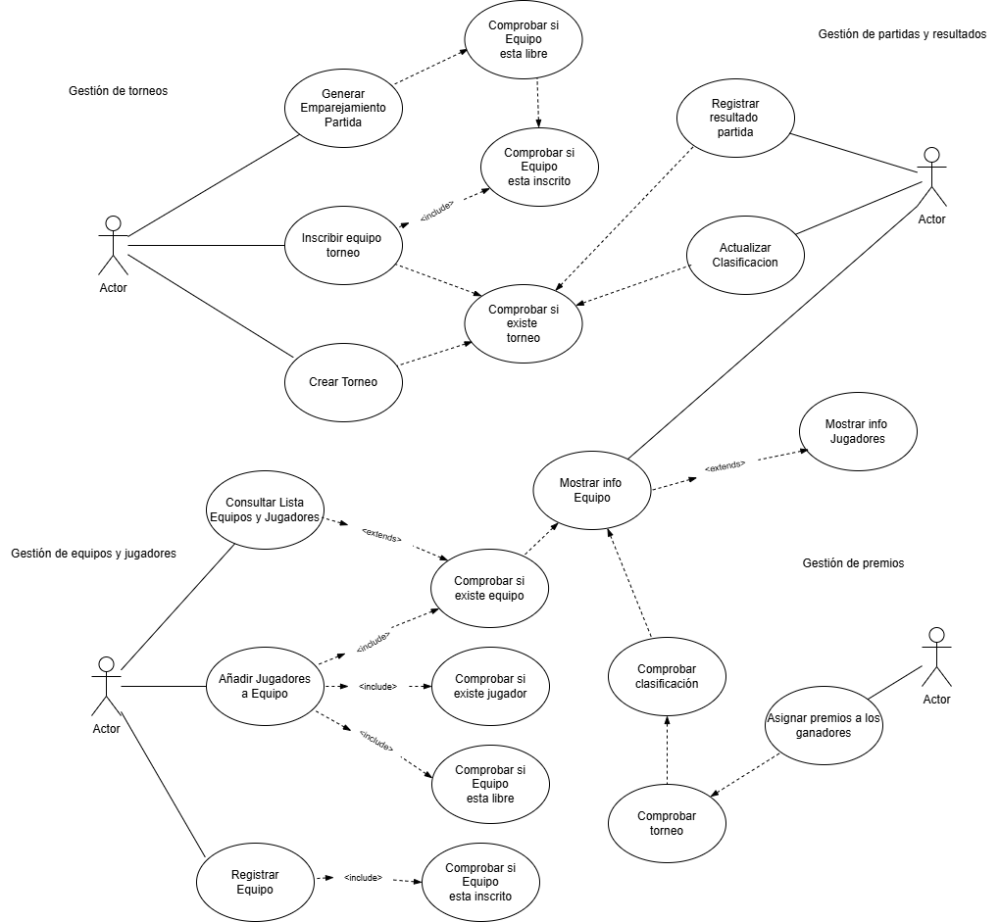
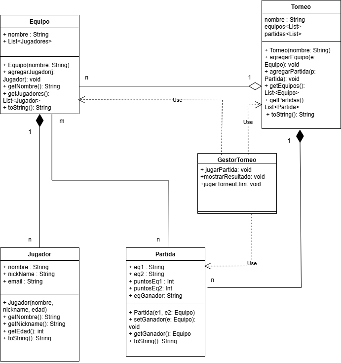

# Sistema de Gestión de Torneos de eSports

## Autor
Aitor QUilez Herrero
Perfil de GitHub: @Thorqui

## Descripción del Proyecto

Link al repositorio del proyecto:
https://github.com/Thorqui/torneo-esports-uml.git

Este proyecto implementa un sistema de gestión de torneos de eSports
utilizando UML para el modelado y Java para la implementación.

1. Análisis del problema y requisitos del sistema

• ¿Quiénes son los actores que interactúan con el sistema?

Administrador: Se encarga de la gestión general del torneo (crear torneos, generar emparejamientos, asignar premios).

Jugador: Forma parte de un equipo y participa en los torneos.

Sistema: Interactúa realizando ciertas acciones (generar emparejamientos, actualizar clasificaciones).

• ¿Cuáles son las acciones que cada actor puede realizar?

Administrador:

Crear un torneo.

Generar emparejamientos de partidas.

Registrar resultado de una partida.

Actualizar clasificación del torneo.

Asignar premios a los ganadores.

Jugador (a través de la gestión de equipos):

Ser añadido a un equipo.

Ver la lista de equipos y jugadores.

Equipo (representado por un responsable):

Registrar un equipo.

Inscribir un equipo en un torneo.

Consultar la lista de equipos y jugadores.

• ¿Cómo se relacionan entre sí las entidades del sistema?

Un Torneo tiene muchos Equipos inscritos.

Un Equipo está compuesto por varios Jugadores.

Un Torneo tiene muchas Partidas.

Una Partida tiene un Resultado.

Un Torneo tiene Premios que se asignan a Equipos ganadores.

## Diagramas UML
### Diagrama de Casos de Uso

1. Gestión de equipos y jugadores
    - Registrar equipo.
    - Añadir jugadores a un equipo.
    - Consultar lista de equipos y jugadores.
2. Gestión de torneos
    - Crear un torneo.
    - Inscribir equipo en un torneo.
    - Generar emparejamientos de partidas.
3. Gestión de partidas y resultados
    - Registrar resultado de una partida.
    - Actualizar clasificación del torneo.
4. Gestión de premios
    - Asignar premios a los ganadores.

### Diagrama de Clases
En el diagrama de clases se estructuran las mismmas con las realciones correspondientes entre ellas.
1. Tendremos relación de COMPOSICION en Equipo-Jugador, puesto que equipo contiene jugadores
   y Torneo-Partida en el que las partidas pertenecen a torneo.
2. AGREGACION será la relación entre Torneo-Equipos, puesto que existen sin el y pertenecen a uno o varios torneos.
3. ASOCIACION en Partida-Equipo, puesto que no se contienen, pero juegan partidas.
4. DEPENDENCIA en el GestorTorneo, el cual usa Torne, Partida y Equipo, pero solo necesita sus métodos.

## Estructura del Proyecto

torneo-esports-uml/ ├── src/
│ ├── es/empresa/torneo/
│ │ ├── modelo/
│ │ ├── control/
│ │ ├── vista/
│ │ ├── Main.java
│ ├── main/java/
│ │   ├── org.example/
│ │      ├── Main.java
│ │   ├── torneo/
│ │      ├── Equipo.java
│ │      ├── GestorTorneo.java
│ │      ├── Jugador.java
│ │      ├── Partida.java
│ │      ├── Torneo.java
│ ├── main/test/java/torneo/  
│ │            ├── EquipoTest.java
│ │            ├── GestorTorneoTest.java
│ │            ├── JugadorTest.java
│ │            ├── PartidaTest.java
│ │            ├── TorneoTest.java
├── diagrams/
│ ├── casos-uso.png
│ ├── clases.png
├── README.md
├── .gitignore
├── LICENSE (opcional)

## Instalación y Ejecución
1. Clonar el repositorio:
   `git clone https://github.com/usuario/torneo-esports-uml.git`

2. Compilar y ejecutar el proyecto:
   `cd src javac es/empresa/torneo/Main.java java es.empresa.torneo.Main`

## Justificación del diseño
Elegi esta estructura ya que al ser una organizacion libre, consideraba que era la mas indicada para un 
proyecto de eSports basico y modificable.
Lo estructuro con las dependencias correctas segun mi criterio en uso logico de un sistema adaptable.

## Conclusiones
Considero un proyecto laborioso que necesita tiempo y dedicacion, pautas nitidas y claras para lo propuesto
para un uso completo, puesto que el libre albedrio en un proyecto tan grande hace dudas multiples y variaciones
eternas.
Considero que un proyecto mas enfocado y mas preciso seria mejor para el desarrollo completo del pryecto.
